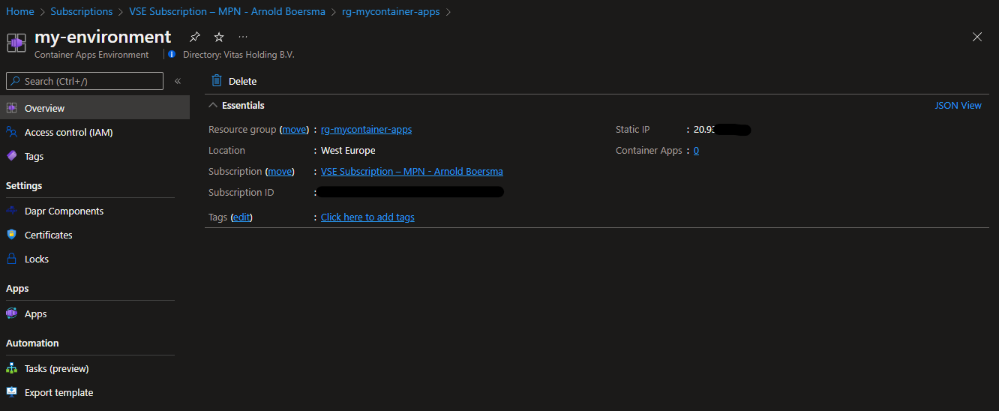

# azure-container-apps-demo

## Prerequitites
- An Azure account with an active subscription.
- [Azure CLI](https://docs.microsoft.com/en-us/cli/azure/install-azure-cli)

### Setup
sign in to Azure from the CLI, and set your default subscription if you have access to multiple subscriptions.
```Bash
az login
az account set --subscription <<subscriptionid>>
```

Install the Azure Container Apps extension for the CLI.
```Bash
az extension add --name containerapp --upgrade

az extension add --name containerapp-compose --upgrade
```

Register the `Microsoft.App` namespace, and the `Microsoft.OperationalInsights` provider for the [Azure Monitor Log Analytics Workspace](https://docs.microsoft.com/en-us/azure/container-apps/observability?tabs=bash#azure-monitor-log-analytics) if you have not used it before.
```Bash
az provider register --namespace Microsoft.App
az provider register --namespace Microsoft.OperationalInsights
az provider register --namespace Microsoft.ContainerRegistry
```

### Setup Azure Resource group
Set a couple of variables
```powershell
$RESOURCE_GROUP="rg-mycontainer-apps"
$LOCATION="westeurope"
$CONTAINERAPPS_ENVIRONMENT="my-environment"
$ACR_NAME="acrmycontainerapps01"
```
Create the resource group
```powershell
az group create `
  --name $RESOURCE_GROUP `
  --location $LOCATION
```


### Create an Azure Container Registry
Store custom containers in ACR to use with Azure Container Apps.

```powershell
$ACR_LOGIN_SERVER=$(az acr create `
  --resource-group $RESOURCE_GROUP `
  --name $ACR_NAME `
  --sku Basic `
  --query loginServer `
  --output tsv)
```

#### Upload images to ACR
Build the images

```Powershell

$ACR_SERVER=$(az acr show -n $ACR_NAME --query loginServer -o tsv)

az acr build -r $ACR_NAME -t $ACR_SERVER/app:v1 ./azure-container-apps-demo -f ./azure-container-apps-demo/app/Dockerfile
az acr build -r $ACR_NAME -t $ACR_SERVER/api:v1 ./azure-container-apps-demo -f ./azure-container-apps-demo/api/Dockerfile
```

### Create an Azure Container Apps environment

```powershell
az containerapp env create `
  --name $CONTAINERAPPS_ENVIRONMENT `
  --resource-group $RESOURCE_GROUP `
  --location $LOCATION
```



Create containers
```powershell
az acr update --name $ACR_NAME --admin-enabled 
$password=$(az acr credential show --name $ACR_NAME --query 'passwords[0].value' -o tsv)
az containerapp compose create --environment $CONTAINERAPPS_ENVIRONMENT `
                               --resource-group $RESOURCE_GROUP `
                               --registry-server acrmycontainerapps01.azurecr.io `
                               --registry-username $ACR_NAME `
                               --registry-password $password


az containerapp create `
  --name api `
  --resource-group $RESOURCE_GROUP `
  --environment $CONTAINERAPPS_ENVIRONMENT `
  --image acrmycontainerapps01.azurecr.io/api:v1 `
  --ingress 'internal' `
  --target-port 80 `
  --registry-server acrmycontainerapps01.azurecr.io `
  --registry-username $ACR_NAME `
  --registry-password $password `
  --query properties.configuration.ingress.fqdn
                       
$api_base_url = $(az containerapp show --name api --resource-group $RESOURCE_GROUP --query 'properties.configuration.ingress.fqdn' -o tsv)

az containerapp create `
  --name app `
  --resource-group $RESOURCE_GROUP `
  --environment $CONTAINERAPPS_ENVIRONMENT `
  --image acrmycontainerapps01.azurecr.io/app:v1 `
  --target-port 80 `
  --ingress 'external' `
  --registry-server acrmycontainerapps01.azurecr.io `
  --registry-username $ACR_NAME `
  --registry-password $password `
  --env-vars API_BASE_URL=$api_base_url `
  --query properties.configuration.ingress.fqdn

```

# Resources
- [Quickstart: Deploy your first container app](https://docs.microsoft.com/en-us/azure/container-apps/get-started?tabs=bash)
- [Accelerating Azure Container Apps with the Azure CLI and Compose Files](https://techcommunity.microsoft.com/t5/apps-on-azure-blog/accelerating-azure-container-apps-with-the-azure-cli-and-compose/ba-p/3516636)